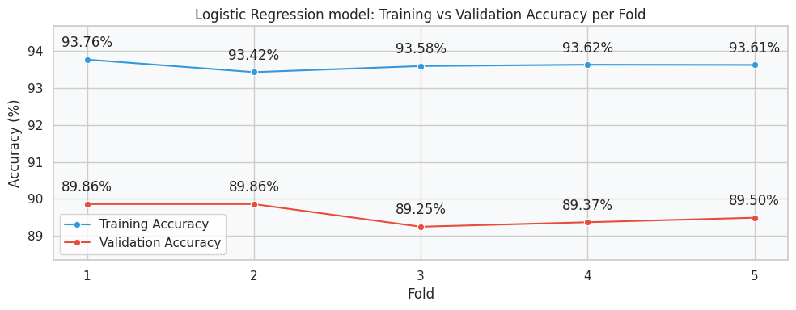
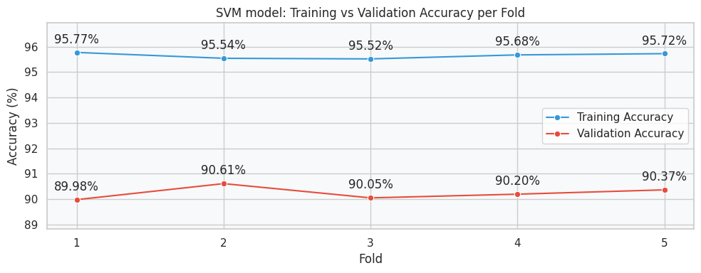
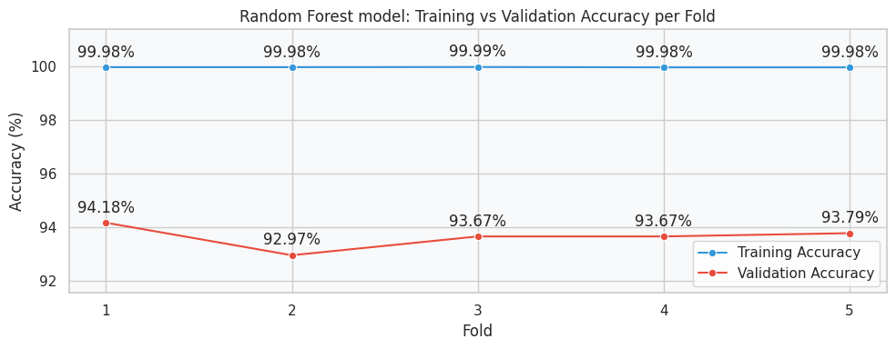
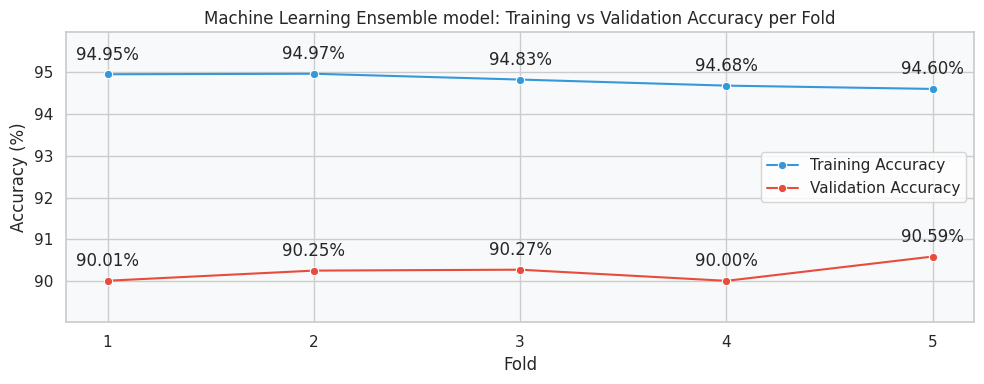

## 5. Implementation:

### 5.1. Machine Learning Models
#### 5.1.1. Chia tập train:

- Sau khi tiền xử lý và oversampling, dữ liệu được biểu diễn bằng **Bag-of-Words**
- Sử dụng **Stratified K-Fold (k = 5)** để chia dữ liệu
- Mỗi fold thì có 80% samples dùng để train, còn lại để validation
- Sau khi train xong, lấy trung bình kết quả trên 5 folds để đánh giá models

#### 5.1.2. Machine Learning Models:
#### Pipeline for training ML models:

#### Logistic Regression:

Mô hình được huấn luyện trên đặc trưng **Bag-of-Words** và đánh giá bằng **5-fold Stratified Cross-Validation**.

Thiết lập mô hình:
- `max_iter = 5000`
- `solver = 'saga'`
- `multi_class = 'multinomial'`

Kết quả trung bình trên 5 folds:
- **Accuracy:** 89.57%
- **Precision:** 0.8983
- **Recall:** 0.8957
- **F1-score:** 0.8955

Accuracy trên tập Training và tập Validation:

#### Support Vector Machine (SVM):

Kết quả trung bình trên 5 folds:
- **Accuracy:** 90.24%
- **Precision:** 0.9043
- **Recall:** 0.9024
- **F1-score:** 0.9020

Accuracy trên tập Training và tập Validation:

#### Random Forest:

Kết quả trung bình trên 5 folds:
- **Accuracy:** 93.65%
- **Precision:** 0.9367
- **Recall:** 0.9365
- **F1-score:** 0.9360

Accuracy trên tập Training và tập Validation:

#### Machine Learning Ensemble (Stacking):

Mô hình Stacking kết hợp nhiều mô hình học máy nhằm tận dụng ưu điểm của từng mô hình. Trong đó:
- Base models:
    - SVM (LinearSVC + scaling)
    - Logistic Regression
- Meta model:
    - Logistic Regression

Kết quả trung bình trên 5 folds:
- **Accuracy:** 90.22%
- **Precision:** 0.9033
- **Recall:** 0.9022
- **F1-score:** 0.9021

Accuracy trên tập Training và tập Validation:

### 5.2. Deep Learning Models:

#### 5.2.1. Chia tập train:

Sau khi oversampling, dữ liệu sẽ được chia như sau:
- Train: 90%
- Validation: 10%

Sử dụng validation được dùng để:
- tuning hyperparameters
- đánh giá model trong quá trình training

#### 5.2.2.Deep Learning Models:

##### Pipeline for training Deep Learning Models:

##### Fully Connected Layers Model:

Kết quả train được:
- **Accuracy**: 93.31
- **Precision**: 0.93
- **Recall**: 0.93
- **F1**: 0.93

##### GRU Model:

Mô hình được tối ưu bằng **RandomizedSearchCV**.  
Bộ tham số tốt nhất thu được là:
- `padding = 'same'`
- `learning_rate = 0.001`
- `l2_reg = 0.1`
- `kernel_initializer = 'he_normal'`
- `epochs = 5`
- `dropout = 0.2`
- `dense_units = 64`
- `batch_size = 16`
- `batch_normalization = False`

Kết quả train được:
- **Accuracy:** 93.79%
- **Precision:** 0.94
- **Recall:** 0.94
- **F1-score:** 0.94
##### Bidirectional RNN Model:

Mô hình được tối ưu bằng **RandomizedSearchCV**.  
Bộ tham số tốt nhất thu được là:
- `learning_rate = 0.001`
- `l2_reg = 0.01`
- `epochs = 3`
- `dropout = 0.2`
- `dense_units = 64`
- `batch_size = 16`
- `batch_normalization = False`

Kết quả train được:
- **Accuracy:** 93.70%
- **Precision:** 0.94
- **Recall:** 0.94
- **F1-score:** 0.94

##### PhoBERT Model:

Mô hình được fine-tune từ **PhoBERT (pretrained Transformer)**.
Bộ tham số chính:
- `learning_rate = 2e-5`
- `epochs = 1`
- `batch_size = 16`
- `dropout` = 0.3`
- `dense_units = 64`

Kết quả train được:
- **Accuracy:** 93.94%
- **Precision:** 0.94
- **Recall:** 0.94
- **F1-score:** 0.94