***PHÂN TÍCH CẢM XÚC PHẢN HỒI CỦA SINH VIÊN VIỆT NAM***
**(Vietnamese Student Sentiment Analysis)**
## 1. Introduction

### 1.1. Giới thiệu bài toán

Trong bối cảnh toàn cầu hóa giáo dục và sự cạnh tranh ngày càng khốc liệt giữa các cơ sở đào tạo đại học, việc nâng cao chất lượng giảng dạy và đáp ứng nhu cầu của người học đã trở thành mục tiêu chiến lược then chốt. Các hệ thống khảo sát định lượng truyền thống (thang Likert) chỉ cung cấp cái nhìn tổng quát về mức độ hài lòng, trong khi phản hồi dạng văn bản tự do của sinh viên lại chứa đựng nguồn thông tin phong phú, chi tiết và sâu sắc về phương pháp giảng dạy, thái độ của giảng viên, nội dung chương trình học cũng như điều kiện cơ sở vật chất.

Tuy nhiên, khối lượng phản hồi văn bản tại các trường đại học lớn thường đạt hàng chục nghìn, thậm chí hàng trăm nghìn mẫu mỗi năm. Việc phân tích thủ công không chỉ tiêu tốn thời gian và nguồn lực hành chính mà còn dễ dẫn đến sai lệch do định kiến chủ quan của con người. Trước thách thức này, các kỹ thuật Khai phá Dữ liệu Văn bản (Text Mining) và Phân tích Cảm xúc (Sentiment Analysis) đã mở ra giải pháp tự động hóa hiệu quả và khoa học.

Bài toán **Vietnamese Student Sentiment Analysis** được đặt ra với mục tiêu cốt lõi là xây dựng một hệ thống Trí tuệ Nhân tạo có khả năng tự động đọc hiểu, phân tích và phân loại cảm xúc từ các nhận xét bằng tiếng Việt của sinh viên. Hệ thống không chỉ hỗ trợ giảng viên và lãnh đạo nhà trường nắm bắt nhanh chóng xu hướng phản hồi mà còn cung cấp cơ sở dữ liệu đáng tin cậy để xây dựng quy trình cải tiến liên tục (Continuous Improvement) trong giáo dục đại học Việt Nam.

### 1.2. Mô hình hóa bài toán: Input và Output

Bài toán được mô hình hóa dưới dạng **phân loại cấp độ câu (Sentence-level Classification)** với cấu trúc ánh xạ rõ ràng:

- **Input**: Đoạn văn bản nhận xét tiếng Việt có độ dài biến thiên, chứa các đặc trưng ngôn ngữ phức tạp của tiếng Việt (từ ghép, dấu thanh, lỗi chính tả, emoji, cách viết mạng xã hội).
- **Output**: Véc-tơ phân phối xác suất thuộc ba lớp cảm xúc:
  - **Positive** (tích cực): khen ngợi, hài lòng, động viên.
  - **Neutral** (trung lập): góp ý xây dựng, nhận xét khách quan, không biểu lộ cảm xúc rõ rệt.
  - **Negative** (tiêu cực): phàn nàn, phê phán, thể hiện sự thất vọng.

Hệ thống chuyển đổi văn bản thô thành véc-tơ số học thông qua các lớp tiền xử lý và vectorization, sau đó ánh xạ sang không gian nhãn thông qua hàm mất mát được tối ưu hóa trong quá trình huấn luyện.

**Hình 1.1**: Sơ đồ tổng quát luồng xử lý từ SQ đến các cấp độ Trí tuệ Nhân tạo 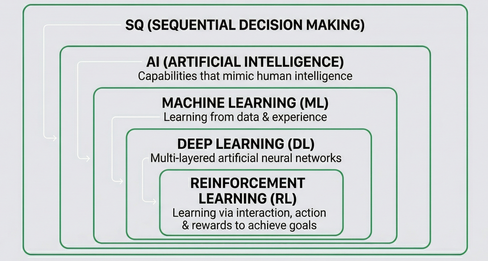


## 2. Ý nghĩa, Các công trình liên quan và Sự tiến hóa của cấu trúc thuật toán

### 2.1. Ý nghĩa khoa học và thực tiễn

**Ý nghĩa khoa học**: Nghiên cứu góp phần bổ sung kho tài nguyên NLP tiếng Việt, đặc biệt trong lĩnh vực phân tích cảm xúc giáo dục – một hướng còn hạn chế so với tiếng Anh. Việc áp dụng thành công các mô hình Transformer hiện đại (PhoBERT) trên dữ liệu thực tế khẳng định khả năng khái quát hóa cao của các mô hình pre-trained trong ngôn ngữ đơn lập có cấu trúc phức tạp.

**Ý nghĩa thực tiễn**: Hệ thống hỗ trợ trực tiếp giảng viên và nhà trường:
- Phát hiện sớm các vấn đề về chất lượng giảng dạy và cơ sở vật chất.
- Cải thiện chương trình đào tạo dựa trên dữ liệu phản hồi thời gian thực.
- Nâng cao chỉ số hài lòng của sinh viên (student satisfaction index), góp phần thúc đẩy chuyển đổi số trong giáo dục đại học Việt Nam.

### 2.2. Sự tiến hóa của cấu trúc thuật toán

Phản hồi của sinh viên là dữ liệu cốt lõi đo lường **Chất lượng Dịch vụ (Service Quality – SQ)**. Để xử lý khối lượng dữ liệu lớn và phi cấu trúc này, các phương pháp Trí tuệ Nhân tạo đã tiến hóa theo thứ tự rõ ràng:

**SQ → AI → Machine Learning → Deep Learning → Reinforcement Learning**

**Hình 2.1**: Sơ đồ tiến hóa các cấp độ Trí tuệ Nhân tạo 

### 2.3. Phân tích ưu và nhược điểm của các hướng tiếp cận

| Hệ thống Thuật toán       | Ưu điểm cốt lõi                                      | Nhược điểm chính                                      |
|---------------------------|------------------------------------------------------|-------------------------------------------------------|
| Machine Learning (ML)     | Tốc độ nhanh, tài nguyên thấp, minh bạch cao (white-box) | Phụ thuộc feature engineering, không nắm bắt ngữ cảnh dài |
| Deep Learning (DL)        | Tự động trích xuất đặc trưng, xử lý ngữ cảnh hai chiều | Yêu cầu dữ liệu lớn, chi phí tính toán cao, black-box |
| Reinforcement Learning (RL) | Tối ưu chuỗi quyết định dài hạn                     | Phức tạp, không cần thiết cho bài toán phân loại tĩnh |

### 2.4. Lý do lựa chọn PhoBERT làm mô hình chính

Random Forest được chọn làm baseline mạnh nhờ khả năng kháng nhiễu và giảm variance thông qua ensemble. Tuy nhiên, **PhoBERT (Transformer)** được lựa chọn làm mô hình sản xuất cuối cùng vì vượt trội về khả năng nắm bắt ngữ nghĩa tiếng Việt, đạt hiệu suất State-of-the-Art (SOTA) và duy trì độ ổn định cao trên dữ liệu thực tế.

**Hình 2.2**: WordCloud của các từ khóa phổ biến trong nhận xét 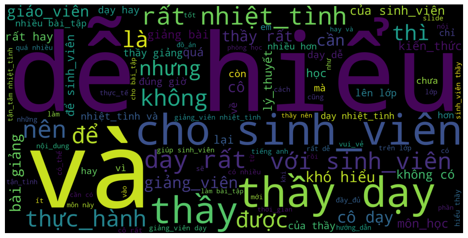


## 3. Phân tích Khám phá và Tiền xử lý Dữ liệu (Processing Data - EDA)

### 3.1. Tổng quan dữ liệu UIT-VSFC

Dữ liệu được lấy từ bộ **UIT-VSFC (Vietnamese Students’ Feedback Corpus)** gồm 16.175 mẫu nhận xét. Phân phối nhãn ban đầu:

- Positive: ~49.7 %
- Negative: ~46.0 %
- Neutral: ~4.3 %

**Hình 3.1**: Biểu đồ phân bố nhãn cảm xúc và chủ đề 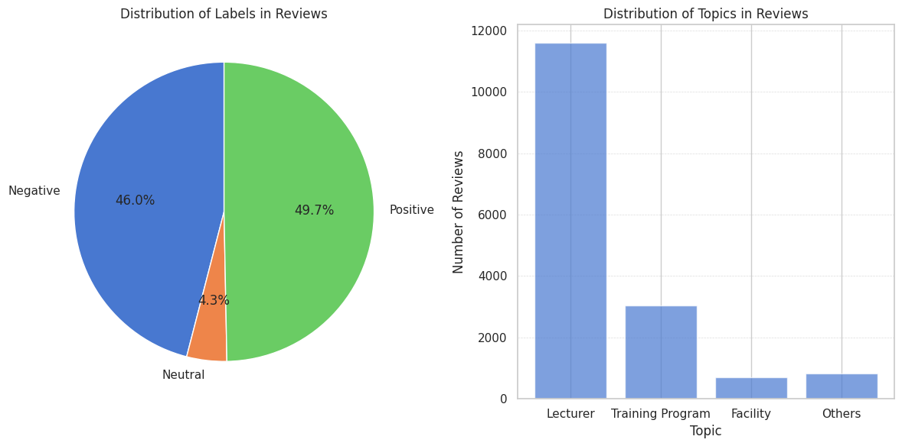

Sau kỹ thuật oversampling, ba lớp đạt sự cân bằng gần như tuyệt đối:

**Hình 3.2**: Biểu đồ phân bố nhãn sau oversampling 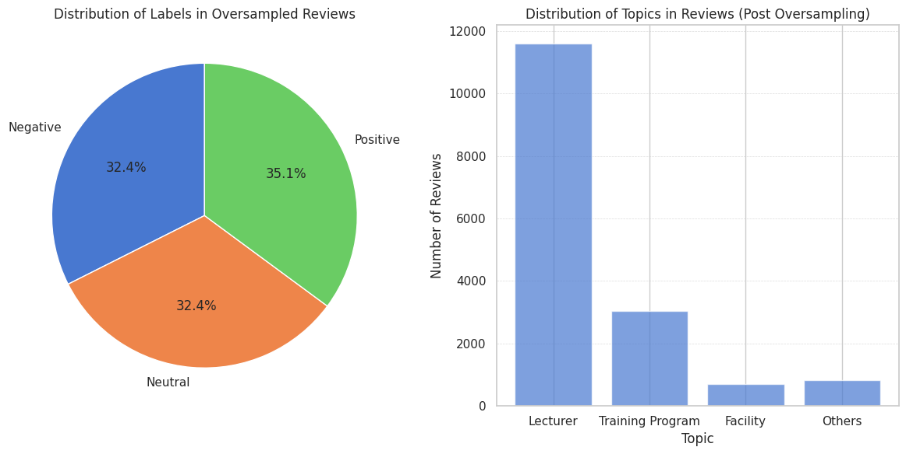

### 3.2. Phân tích độ dài câu và WordCloud

**Hình 3.3**: Phân bố độ dài câu 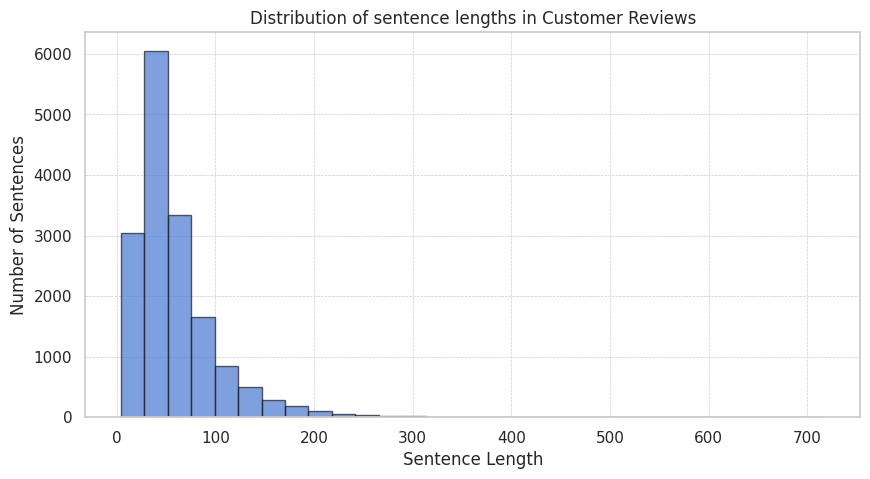 – Phần lớn nhận xét có độ dài dưới 100 từ, phù hợp cho việc padding/truncation ở max_length = 256.

**Hình 3.4**: WordCloud các từ khóa phổ biến  – Các cụm từ nổi bật: “giảng viên”, “dạy”, “nhiệt tình”, “dễ hiểu”, “sinh viên”, “thầy/cô”.

### 3.3. Đường ống tiền xử lý ngôn ngữ

Quá trình tiền xử lý bao gồm bốn giai đoạn chính:
1. Làm sạch văn bản cơ bản (lowercase, loại emoji, giảm ký tự lặp, chuẩn hóa dấu câu).
2. Chuẩn hóa tiếng Việt (`underthesea.text_normalize`).
3. Tách từ (`underthesea.word_tokenize` với định dạng underscore để giữ từ ghép).
4. Vectorization / Tokenization cho Transformer (`max_length = 256`).

**Hình 3.5**: KMeans Clustering sau PCA 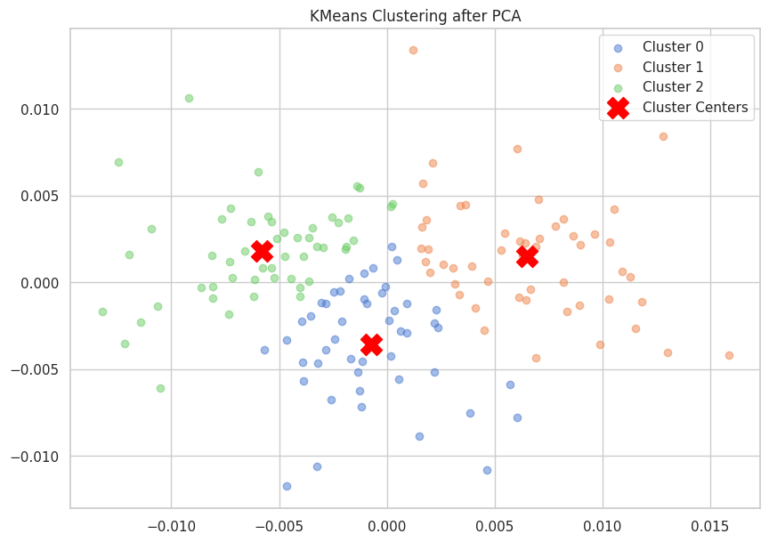 – Minh họa trực quan các cụm chủ đề trong dữ liệu.

Các bước trên đảm bảo dữ liệu đầu vào sạch, chuẩn hóa và sẵn sàng cho cả hai nhánh Machine Learning và Deep Learning/Transformer.


## 4. Data Preparation & Feature Engineering:

Trong bài toán này, nhóm sẽ sử dụng dataset: `uit-nlp/vietnamese_students_feedback` (HuggingFace)
Dataset bao gồm 16,175 samples, chứa các phản hồi của sinh viên về giảng viên, bao gồm:

- Nội dung văn bản (Sentence)
- Nhãn cảm xúc (Sentiment) (0: Negative, 1: Neutral, 2: Positive)
- Chủ đề (Topic)

### 4.1. Data Prepareation

Dataset được lấy từ HuggingFace:

```python
dataset = load_dataset("uit-nlp/vietnamese_students_feedback")
```

Sau đó, tiến hành trộn các tập dataset (train + validation + test) thành 1 DataFrame để thuận tiện cho việc xử lý:

```python
df = pd.concat([train_df, val_df, test_df], ignore_index=True)
df = df.sample(frac=1).reset_index(drop=True)
df.rename(columns={'sentence': 'content', 'sentiment': 'label'}, inplace=True)
```

### 4.2. Text Processing:

Trước tiên, nhóm sẽ tiền hành bước làm sạch dữ liệu bằng cách loại bỏ những dữ liệu bị lăp, và những dữ liệu mang giá trị NaN:

```python
df = df.drop_duplicates("content")  # remove duplicates
df = df.dropna()                   # remove null values
```

Tiếp theo, nhóm sẽ bắt đầu tiến hành việc tiền xử lý văn bản:

1. Chuẩn hóa văn bản
2. Loại bỏ emoji
3. Chuẩn hóa kí tự lặp
4. Chuẩn hóa dấu câu
5. Loại bỏ dấu câu & kí tự đặc biệt
6. Chuẩn hóa khoản trắng

Cuối cùng, nhóm sẽ tiến hành tokenization tiếng Việt, và kết quả:

| STT | Content                                           | Label | Topic | Corpus                                             |
| --- | ------------------------------------------------- | ----- | ----- | -------------------------------------------------- |
| 0   | tổ chức các cuộc thi liên quan tới kỹ năng gia... | 2     | 1     | tổ_chức các cuộc thi liên_quan tới kỹ_năng gia...  |
| 1   | ít mục không đi sâu vào .                         | 0     | 3     | ít mục không đi_sâu vào                            |
| 2   | thầy cung cấp nhiều kiến thức mới , thầy dạy t... | 2     | 0     | thầy cung_cấp nhiều kiến_thức mới thầy dạy tận...  |
| 3   | boss cuối , thầy dạy quá hay , cả kiến thức mô... | 2     | 0     | bos cuối thầy dạy quá hay cả kiến_thức môn_học...  |
| 4   | thấy rất giỏi và dạy rất tốt , nhiệt tình , dễ... | 2     | 0     | thấy rất giỏi và dạy rất tốt nhiệt_tình dễ hiểu    |
| 5   | thầy wzjwz307 dạy giỏi từ xưa đến giờ .           | 2     | 0     | thầy wzjwz307 dạy giỏi từ xưa đến giờ              |
| 6   | giảng viên tuyệt vời nhất uit .                   | 2     | 0     | giảng_viên tuyệt_vời nhất uit                      |
| 7   | giáo viên dạy có tâm huyết , nhiệt tình với si... | 2     | 0     | giáo_viên dạy có tâm_huyết nhiệt_tình với sinh...  |
| 8   | một số phần thầy chưa nói rõ gây khó khăn cho ... | 0     | 0     | một_số phần thầy chưa nói rõ gây khó_khăn cho ...  |
| 9   | chưa thực sự tận dụng tốt thời gian và chưa mở... | 2     | 0     | chưa thực_sự tận_dụng tốt thời_gian và chưa mở...  |
| 10  | em thấy việc thầy dời deadline nó không phù hợ... | 0     | 0     | em thấy việc thầy dời deadline nó không phù_hợp... |
| 11  | dễ tiếp cận kiến thức .                           | 2     | 0     | dễ tiếp_cận kiến_thức                              |
| 12  | thầy nên đưa ra những ví dụ trong khi giảng bà... | 0     | 0     | thầy nên đưa ra những ví_dụ trong khi giảng bà...  |
| 13  | thay vì ngồi chờ chấm điểm như đi thi thực hành . | 1     | 1     | thay_vì ngồi chờ chấm điểm như đi thi thực_hành    |
| 14  | thầy cố gắng giảng bài cho mọi người hiểu , cố... | 2     | 0     | thầy cố_gắng giảng_bài cho mọi người hiểu cố_g...  |
| 15  | giảng bài dễ hiểu , dễ vận dụng .                 | 2     | 0     | giảng bài dễ hiểu dễ vận_dụng                      |

### 4.3. EDA:

#### 4.3.1. Phân tích tần suất từ (Bag-of-Words):

Đầu tiên, nhóm sẽ xây dựng một biểu diễn đơn giản dạng Bag-of-Words bằng cách gom toàn bộ các câu đã được xử lý (corpus) và đếm tấn suất xuất hiện của token:

```python
all_words = [token for token in df['corpus'].tolist() if token and token != '']
corpus = ' '.join(all_words)
all_words = nltk.FreqDist(all_words)
```

Kết quả:

```
Number of words: 16001
Most common words: [('thầy dạy hay dễ hiểu', 4), ('nhiệt_tình vui_tính', 3), ('thầy dạy nhiệt_tình tận_tâm', 3), ('giảng_viên dạy nhiệt_tình dễ hiểu', 3), ('giảng_viên tận_tâm nhiệt_tình', 3), ('nhiệt_tình tâm_huyết', 3), ('giảng_viên nhiệt_tình tận_tâm', 3), ('em cảm_ơn', 3), ('thầy giảng bài dễ hiểu nhiệt_tình', 2), ('cô dạy rất hay', 2), ('nhiệt_tình thân_thiện', 2), ('cô nhiệt_tình tận_tâm', 2), ('em rất thích', 2), ('thầy tận tâm', 2), ('vui_vẻ nhiệt_tình', 2)]
```

#### 4.3.2. WordCloud Visualization:

Để trực quan hóa tàn suất từ, nhóm sử dụng WordCloud.
Ý nghĩa của biểu đồ:

- Từ xuất hiện càng nhiều - hiển thị càng lớn
- Giúp nhanh chóng nhận diện: chủ đề - tính chất của feedback

Code như sau:

```python
word_cloud = wordcloud.WordCloud(
    max_words=100,
    background_color="black",
    width=2000,
    height=1000
).generate(corpus)
```

Kết quả:
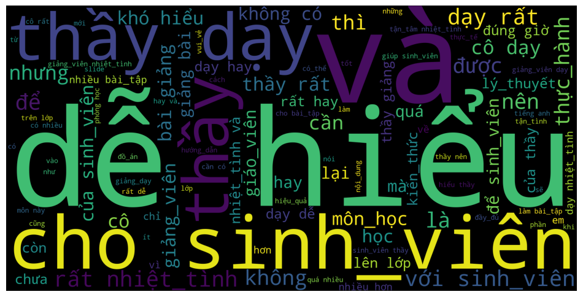

#### 4.3.3. Phân phối độ dài câu:

Nhóm phân tích độ dài của từng câu trong bộ dữ liệu, việc này giúp chúng ta hiểu được:

- Số lượng câu ngắn, câu dài
- Có cần padding/ truncation không?

Code như sau:

```python
# Calculate the length of each sentence directly
lengths = df['content'].apply(len)

# Plot histogram
plt.figure(figsize=(10, 5))
plt.hist(lengths, bins=30, edgecolor='k', alpha=0.7)
plt.title('Distribution of sentence lengths in Customer Reviews')
plt.xlabel('Sentence Length')
plt.ylabel('Number of Sentences')
plt.grid(True, which='both', linestyle='--', linewidth=0.5)
plt.show()
```

Kết quả:
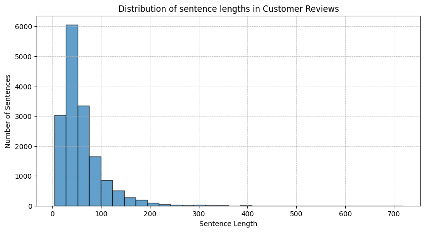

#### 4.3.3. Phân phối nhãn và topic:

Sau bước tiền xử lý và khám phá dữ liệu ban đầu, chúng tôi tiến hành phân tích phân phối của **sentiment labels** và **topics** nhằm hiểu rõ hơn về cấu trúc dataset. Đây là bước quan trọng giúp phát hiện các vấn đề như mất cân bằng dữ liệu (data imbalance), từ đó định hướng chiến lược huấn luyện mô hình.

Kết quả sau khi trực quan hóa:
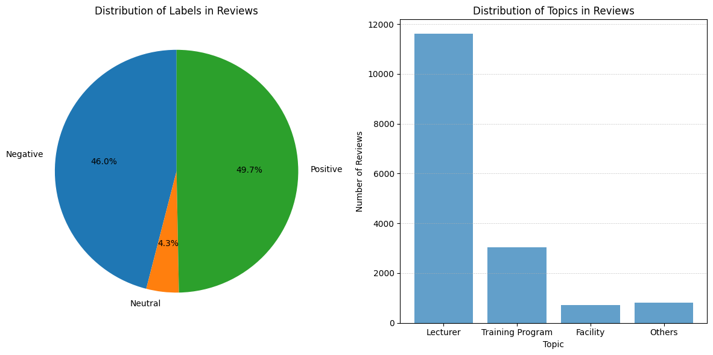

##### Phân phối nhãn cảm xúc:

Biểu đồ tròn thể hiện tỷ lệ các nhãn cảm xúc trong tập dữ liệu:

- Positive (~49.7%)
- Negative (~46.0%)
- Neutral (~4.3%)
  Từ đó, ta thấy rằng dataset cân bằng giữa hai lớp Positive và Negative, nhưng lớp Neutral chiếm tỷ lệ rất nhỏ

##### Phân phối chủ đề:

Biểu đồ cột dưới đây thể hiện số lượng review theo từng chủ đề:

- **Lecturer** chiếm đa số (áp đảo)
- **Training Program** đứng thứ hai
- **Facility** và **Others** có số lượng khá ít

### 4.4. Over-sampling:

Trong bước phân tích trước, nhóm nhận thấy rằng dataset gặp vấn đề **mất cân bằng dữ liệu (class imbalance)**, đặc biệt ở lớp **Neutral**, khi chỉ chiếm khoảng ~4% tổng số mẫu.

Để giải quyết vấn đề này, chúng tôi áp dụng kỹ thuật **Over-sampling** nhằm cân bằng lại phân phối các nhãn.
Cụ thể:

- Lớp **Neutral (label = 1)** là lớp thiểu số
- Chúng tôi sẽ **duplicate các sample Neutral** cho đến khi số lượng gần bằng các lớp còn lại

Cách thực hiện:

```python
neutral_indices = np.where(train_labels == 1)[0]
oversample_size = len(train_labels[train_labels == 0]) - len(neutral_indices)

oversampled_neutral_indices = resample(
    neutral_indices,
    replace=True,
    n_samples=oversample_size
)
```

Sau Oversampling, có một bộ dataset mới chứa dữ liệu gốc, thêm dữ liệu Neutral nhân bản.
Kết quả:

```
Label 0: 6695
Label 1: 6695
Label 2: 7233
```

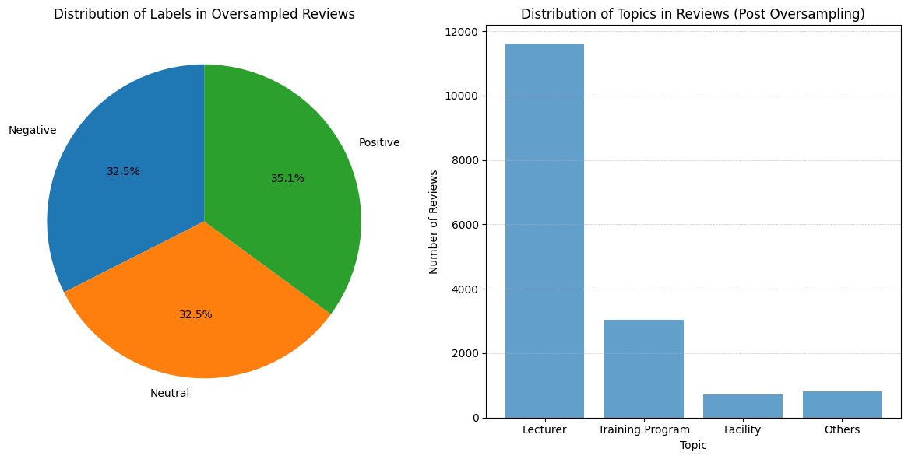

Bước này cực kì quan trọng, để làm cho dataset được cân bằng hơn, việc này giúp cho model có thể học tốt hơn

### 4.5. Feature Engineering:

#### 4.5. Bag-of-Words:

Sử dụng `CountVectorizer` để chuyển văn bản thành vector số bằng cách **đếm số lần xuất hiện của từng từ** trong câu.

Triển khai:

```python
vectorizer = CountVectorizer()
vectorizer.fit(train_sentences)
```

Kết quả:

```
Sentence: bài giảng dễ hiểu
Token : Count
bài : 1
dễ : 1
giảng : 1
hiểu : 1
------

Sentence: giảng_viên hỗ_trợ tích_cực
Token : Count
giảng_viên : 1
hỗ_trợ : 1
tích_cực : 1
------

Sentence: giảng_dạy nhiệt_tình đúng giờ
Token : Count
giảng_dạy : 1
giờ : 1
nhiệt_tình : 1
đúng : 1
------
```

Áp dụng cho toàn bộ dữ liệu:

```python
X_oversampled_bow = vectorizer.transform(train_sentences_oversampled)
y_oversampled_bow = train_labels_oversampled
```

#### 4.6. Text Vectorization:

Sử dụng `TextVectorization` để chuyển văn bản thành **chuỗi số (integer sequence)**, phục vụ cho các mô hình deep learning.

#### Cấu hình:

```python
MAX_VOCAB_LENGTH = 20000

sequence_lengths = [len(sentence.split()) for sentence in train_sentences]
MAX_LENGTH = int(np.percentile(sequence_lengths, 95))
```

- `MAX_VOCAB_LENGTH`: giới hạn số từ trong vocabulary
- `MAX_LENGTH`: độ dài câu (lấy theo percentile 95% để tránh outliers)

#### Khởi tạo:

```python
text_vectorizer = TextVectorization(
    max_tokens=MAX_VOCAB_LENGTH,
    standardize="lower_and_strip_punctuation",
    split="whitespace",
    output_mode="int",
    output_sequence_length=MAX_LENGTH
)
```

#### Huấn luyện Vocabulary:

```python
text_vectorizer.adapt(train_sentences)
```

#### Kết quả:

```
Number of words in vocab: 4543
Top 5 most common words: ['', '[UNK]', 'thầy', 'sinhviên', 'dạy']
Bottom 5 least common words: ['2000', '200', '1983', '19', '140']
```

#### 4.7. Embedding:

Embedding là lớp dùng để chuyển các số (sau khi vectorization) thành **vector dense có ý nghĩa ngữ nghĩa**.

#### Khởi tạo:

```python
def create_embedding_layer(
    input_dim=MAX_VOCAB_LENGTH,
    output_dim=128,
    input_length=MAX_LENGTH
):
    return layers.Embedding(
        input_dim=input_dim,
        output_dim=output_dim,
        input_length=input_length
    )
```

- `input_dim`: kích thước vocabulary
- `output_dim`: số chiều của vector embedding (ví dụ: 128)
- `input_length`: độ dài chuỗi input

#### Cách hoạt động:

Input:

```
[12, 45, 78, ...]
```

Output:

```
[
  [0.12, -0.45, ...],
  [0.78, 0.11, ...],
  ...
]
```

### 4.7. Pipeline Summary:


## 5. Implementation:
### 5.1. Machine Learning Models:
#### 5.1.1. Tổng quan pipeline training:

Code được tổ chức theo hướng khá rõ ràng, gồm 4 phần chính:
1. **Tạo model** từ tên mô hình.
2. **Huấn luyện và đánh giá bằng K-Fold**.
3. **Tính metric** gồm Accuracy, Precision, Recall, F1-score.
4. **Hiển thị và so sánh kết quả** giữa các mô hình.

#### 5.1.2. Hàm tạo mô hình

Phần đầu tiên là hàm `create_ml_model(model_type, **kwargs)`. Hàm này đóng vai trò như một **factory function**: truyền vào tên model, hàm sẽ trả về đúng đối tượng mô hình tương ứng. Các model được dùng để train cho bài toàn này:
- `naive_bayes` → `MultinomialNB`
- `svm` → `LinearSVC`
- `random_forest` → `RandomForestClassifier`
- `logistic_regression` → `LogisticRegression`
- `ml_ensemble` → mô hình stacking do hàm `create_ml_stacking_classifier()` tạo ra

Ví dụ:
```python
lr_model = create_ml_model(  
    'logistic_regression',  
    max_iter=5000,  
    solver='saga',  
    multi_class='multinomial'  
)
```

Đoạn trên tạo ra một mô hình Logistic Regression cho bài toán phân loại nhiều lớp. `max_iter=5000` giúp mô hình có đủ số vòng lặp để hội tụ, còn `solver='saga'` phù hợp với dữ liệu lớn và hỗ trợ `multinomial`.

#### 5.1.3. Train models bằng Stratified K-Fold:

Phần quan trọng nhất của code nằm ở hàm `kfold_evaluation(model, X, y, kfold)`. Đây là nơi mô hình được train và đánh giá.

##### 3.1. Vì sao dùng Stratified K-Fold?

Code khởi tạo:
```python
skf = StratifiedKFold(n_splits=5, shuffle=True)
```

`StratifiedKFold` khác với KFold thường ở chỗ nó đảm bảo **tỷ lệ các lớp trong mỗi fold gần giống với toàn bộ dataset**. Điều này đặc biệt quan trọng trong các bài toán phân loại khi dữ liệu bị lệch lớp.

##### 3.2. Quy trình train trong từng fold

Trong mỗi vòng lặp:
1. Tách dữ liệu thành `X_train`, `X_val`, `y_train`, `y_val`
2. Gọi `model.fit(X_train, y_train)` để train
3. Dự đoán trên cả tập train và validation
4. Tính metric cho cả hai tập
5. Lưu lại kết quả từng fold

Code cốt lõi:
```python
for train_index, val_index in skf.split(X, y):  
    X_train, X_val = X[train_index], X[val_index]  
    y_train, y_val = y[train_index], y[val_index]  
  
    model.fit(X_train, y_train)  
  
    train_predictions = model.predict(X_train)  
    val_predictions = model.predict(X_val)
```

Ý tưởng rất chuẩn:

- **Train metrics** cho biết mô hình học tốt đến mức nào trên dữ liệu đã thấy
- **Validation metrics** cho biết mô hình tổng quát hóa tốt đến đâu trên dữ liệu chưa thấy trong fold đó

##### 3.3. Tính kết quả trung bình sau 5 folds

Sau khi chạy xong 5 folds, code lấy trung bình Accuracy, Precision, Recall và F1-score của các tập validation:

```python
model_results = {  
    "accuracy": np.mean([result["accuracy"] for result in fold_results]),  
    "precision": np.mean([result["precision"] for result in fold_results]),  
    "recall": np.mean([result["recall"] for result in fold_results]),  
    "f1": np.mean([result["f1"] for result in fold_results])  
}
```

Điều này cho ta một đánh giá ổn định hơn so với việc chỉ chia train/test một lần.

##### 3.4. Retrain trên toàn bộ dữ liệu

Cuối hàm có đoạn:
```python
model.fit(X, y)
```

Điều này nghĩa là sau khi đánh giá xong bằng cross-validation, mô hình sẽ được train lại trên **toàn bộ dataset** để tạo ra phiên bản cuối cùng sẵn sàng đem đi sử dụng hoặc lưu lại.

### 5.2. Deep Learning Models:

#### 5.2.1. Tổng quan pipeline training:

Toàn bộ pipeline Deep Learning gồm 4 bước chính:
##### Bước 1: Chuẩn bị dữ liệu
- Dữ liệu đã được **oversampling**
- Sau đó split thành:
```python
X_train, X_val, y_train, y_val = train_test_split(..., test_size=0.1
```

Chia dataset thành 2 phần: 90% train, 10% validation
##### Bước 2: Định nghĩa hyperparameter search space
```python
param_dist = {  
    'learning_rate': [0.01, 0.001, 0.0001],  
    'dense_units': [32, 64, 128],  
    'dropout': [0.2, 0.3, 0.4, 0.5],  
    'l1_reg': [0.001, 0.01, 0.1],  
    'l2_reg': [0.001, 0.01, 0.1],  
    ...  
}
```

Đây là không gian tìm kiếm hyperparameter cho model.
##### Bước 3: Hyperparameter tuning bằng RandomizedSearchCV

Hàm chính:
```python
perform_random_search(...)
```

Ý tưởng:
- Wrap model bằng `KerasClassifier`
- Random sample các config
- Train + validate bằng cross-validation
- Chọn best parameters
##### Bước 4: Evaluate model
Sau khi tìm best model:
```python
display_dl_results(best_model, ...)
```

- Predict trên validation set
- Tính:
    - Accuracy
    - Precision
    - Recall
    - F1-score
#### 5.2.2. Các mô hình được dùng để train:

##### Model 1 - Fully Connected Neural Network:

Best hyperparameters:
```
learning_rate = 0.001
dense_units = 32
dropout = 0.2
epochs = 5
batch_size = 64
```
##### Model 2: GRU

Best hyperparameters:
```
learning_rate = 0.001
dense_units = 64
dropout = 0.2
batch_size = 16
```
##### Model 3: Bidirectional LSTM

Best hyperparameters:
```
learning_rate = 0.001  
dense_units = 64  
dropout = 0.2  
epochs = 3
```
#### 5.2.3. PhoBERT Model:

Khác với các mô hình Deep Learning ở trên như Fully Connected, GRU hay Bidirectional LSTM, PhoBERT không học từ đầu hoàn toàn trên dataset của bài toán, mà sử dụng mô hình ngôn ngữ tiếng Việt đã được pretrained sẵn là `vinai/phobert-base`, sau đó fine-tune lại cho bài toán phân loại cảm xúc 3 lớp. Trong code, PhoBERT được triển khai theo pipeline:
```
Text -> Tokenizer -> input_ids + attention_mask -> PhoBERT -> CLS token -> Dense -> Softmax
```
Cách làm này cho phép mô hình tận dụng kiến thức ngôn ngữ đã học trước đó trên tập dữ liệu lớn, từ đó biểu diễn ngữ nghĩa của câu tốt hơn so với các mô hình train từ đầu.

##### Bước 1: Tokenization và mã hóa dữ liệu

Đầu tiên, code khởi tạo tokenizer của PhoBERT bằng `AutoTokenizer.from_pretrained("vinai/phobert-base")`. Sau đó, hàm `encode_texts_for_phobert(sentences, max_length=128)` được dùng để chuyển văn bản đầu vào thành hai tensor:
- `input_ids`: biểu diễn ID của các token
- `attention_mask`: đánh dấu vị trí token thật và vị trí padding

Trong quá trình encode, dữ liệu được:
- chuyển về danh sách chuỗi
- cắt bớt nếu vượt quá độ dài tối đa
- padding về cùng độ dài `max_length = 128`

Điều này giúp toàn bộ câu đầu vào có cùng kích thước khi đưa vào mô hình.
##### Bước 2: Xây dựng mô hình PhoBERT

PhoBERT được implement trong hàm `create_phobert_model(max_length=128, learning_rate=2e-5)`. Mô hình nhận hai đầu vào là `input_ids` và `attention_mask`, sau đó truyền qua backbone `TFAutoModel.from_pretrained("vinai/phobert-base")`.

Output của PhoBERT là tensor biểu diễn ngữ cảnh cho toàn bộ chuỗi. Trong code, nhóm lấy vector của token đầu tiên (`CLS token`) làm vector đại diện cho cả câu:
```python
cls_token = embeddings[:, 0, :]
```

Vector này sau đó được đưa qua:
- `Dropout(0.3)` để giảm overfitting
- `Dense(64, activation='relu')`
- `Dense(3, activation='softmax')` để dự đoán xác suất cho 3 lớp

##### Bước 3: Compile và train mô hình
Sau khi xây dựng xong, mô hình được compile với:
- `optimizer = Adam`
- `learning_rate = 2e-5`
- `loss = sparse_categorical_crossentropy`
- `metrics = ['accuracy']`

Learning rate rất nhỏ là lựa chọn phù hợp khi fine-tune các mô hình pretrained như PhoBERT, nhằm tránh làm mất đi những tri thức ngôn ngữ đã học sẵn từ trước.

Quá trình train được thực hiện bằng:
```python
history_phobert = phobert_model.fit(  
    x=[train_input_ids, train_attention_mask],  
    y=y_train,  
    validation_data=([val_input_ids, val_attention_mask], y_val),  
    epochs=1,  
    batch_size=16  
)
```

Điều này cho thấy mô hình được fine-tune trực tiếp trên tập train, đồng thời theo dõi hiệu năng trên tập validation.

##### Bước 4: Kết quả mô hình

Sau quá trình huấn luyện, PhoBERT đạt kết quả trên tập validation như sau:
- Accuracy: **93.94%**
- Precision: **0.94**
- Recall: **0.94**
- F1-score: **0.94**

Kết quả này cho thấy PhoBERT là một trong những mô hình mạnh nhất trong toàn bộ pipeline, nhờ khả năng tận dụng biểu diễn ngữ nghĩa sâu của tiếng Việt từ quá trình pretraining.
##### Các tham số chính được sử dụng khi fine-tune PhoBERT trong code gồm:
```
max_length = 128  
learning_rate = 2e-5  
dropout = 0.3  
dense_units = 64  
batch_size = 16  
epochs = 1
```

## 6. Triển khai ứng dụng Web:

Sau khi hoàn tất quá trình huấn luyện mô hình phân tích cảm xúc tiếng Việt, nhóm tiến hành triển khai mô hình lên ứng dụng web nhằm cho phép người dùng tương tác trực tiếp với hệ thống.  
Phần giao diện người dùng (UI) được xây dựng bằng thư viện **Gradio**, và toàn bộ ứng dụng được triển khai trên nền tảng **Hugging Face Spaces**, giúp người dùng có thể truy cập và sử dụng trực tuyến mà không cần cài đặt phức tạp.

🔗 **Link ứng dụng web**:  
[Vietnamese Student Sentiment Analysis - a Hugging Face Space by oriontk24](https://huggingface.co/spaces/oriontk24/Vietnamese-Sentiment-Analysis)
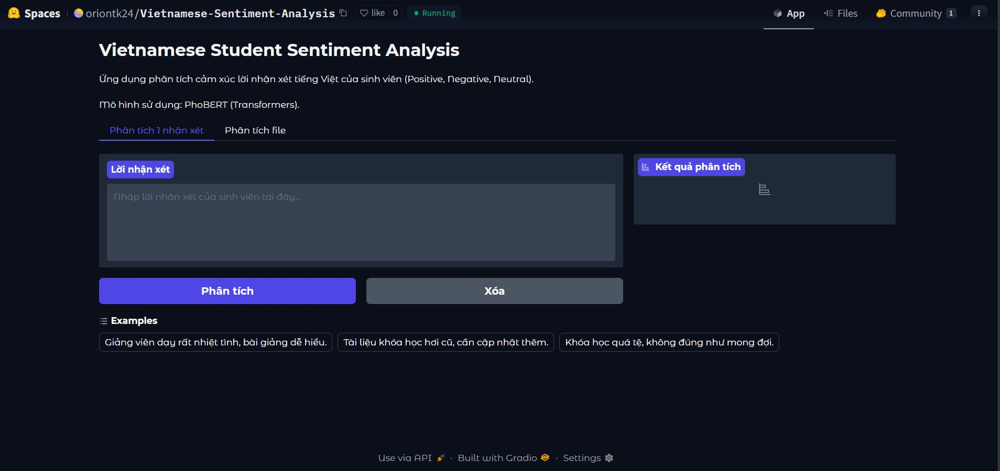
_Hình 6.1: Giao diện ứng dụng web phân tích cảm xúc tiếng Việt triển khai bằng Gradio trên Hugging Face Spaces._
## 6.1. Kiến trúc dự án:
```
project/  
├── app.py                     # Gradio UI + xử lý inference  
├── phobert_production_bundle.zip  # Model + tokenizer đã đóng gói  
├── requirements.txt          # Danh sách thư viện cần thiết  
├── sample_comments.csv       # Dữ liệu mẫu để test batch inference  
├── test_phobert.py           # Script test model  
└── notebook.ipynb            # File huấn luyện model
```
## 6.2. Quy trình xử lý và dự đoán:

Luồng hoạt động của hệ thống được mô tả như sau:
### Single Inference (Dự đoán đơn lẻ):

1. Người dùng nhập một đoạn văn bản tiếng Việt vào giao diện
2. Văn bản được xử lý và tokenize bằng **PhoBERT tokenizer**
3. Dữ liệu được đưa vào mô hình đã huấn luyện
4. Hệ thống trả về kết quả dự đoán dưới dạng xác suất cho từng lớp:
    - Positive 😊
    - Neutral 😐
    - Negative 😡
5. Kết quả được hiển thị trực quan dưới dạng **Bar Chart**
### Batch Inference (Dự đoán hàng loạt):

1. Người dùng upload file CSV/Excel chứa nhiều bình luận
2. Hệ thống tự động:
    - Nhận diện cột chứa văn bản
    - Tiền xử lý dữ liệu
3. Thực hiện dự đoán hàng loạt
4. Trả về:
    - File kết quả đã gán nhãn
    - Biểu đồ phân bố cảm xúc (**Pie Chart**)
## 6.3. Quy trình triển khai (Deployment Pipeline):

1. **Model Packaging**:  
    Mô hình đã huấn luyện (`keras_model`) và tokenizer được đóng gói thành file `.zip` nhằm tối ưu dung lượng lưu trữ và dễ dàng deploy.
2. **Model Loading**:  
    Khi ứng dụng khởi chạy, hệ thống tự động giải nén file vào thư mục `model/phobert_bundle` và load model bằng `tf.keras`.
3. **UI Integration**:  
    Gradio được sử dụng để xây dựng giao diện tương tác trực quan, hỗ trợ cả dự đoán đơn và batch.
4. **Cloud Deployment**:  
    Source code (`app.py`), model và `requirements.txt` được upload lên Hugging Face Spaces để chạy online.

## 6.4. Hướng dẫn chạy local:

Bạn có thể clone và chạy project trên máy cá nhân theo các bước sau:
```
# 1. Clone source code  
git clone https://huggingface.co/spaces/oriontk24/Vietnamese-Sentiment-Analysis  
cd Vietnamese-Sentiment-Analysis  
  
# 2. Cài đặt thư viện  
pip install -r requirements.txt  
  
# 3. Chạy server  
python app.py
```
## 7. Đánh giá kết quả và Thảo luận

### 7.1. Hệ thống thang đo đánh giá (Evaluation Metrics)

Để đánh giá một cách khách quan, toàn diện và khoa học hiệu suất của các mô hình, nghiên cứu sử dụng bộ chỉ số tiêu chuẩn trong bài toán phân loại đa lớp:

- **Accuracy (Độ chính xác toàn cục)**:  
  \[
  \text{Accuracy} = \frac{TP + TN}{TP + TN + FP + FN}
  \]

- **Precision (Độ chuẩn xác)**:  
  \[
  \text{Precision} = \frac{TP}{TP + FP}
  \]

- **Recall (Độ phủ / Độ nhạy)**:  
  \[
  \text{Recall} = \frac{TP}{TP + FN}
  \]

- **F1-Score (Trung bình điều hòa)**:  
  \[
  F1 = 2 \times \frac{\text{Precision} \times \text{Recall}}{\text{Precision} + \text{Recall}}
  \]

Tất cả các chỉ số đều được tính theo chế độ **weighted average** nhằm phản ánh chính xác sự phân bố của ba lớp cảm xúc. Đặc biệt, với dữ liệu ban đầu có sự mất cân bằng nghiêm trọng (lớp Neutral chỉ chiếm khoảng 4,3 %), **F1-Score** được coi là thước đo quan trọng nhất vì nó cân bằng giữa Precision và Recall, giúp tránh tình trạng mô hình thiên vị về các lớp đa số.

**Hình 7.1**: Biểu đồ phân bố nhãn cảm xúc ban đầu và chủ đề   
**Hình 7.2**: Biểu đồ phân bố nhãn sau khi oversampling 

### 7.2. Bảng so sánh hiệu suất tổng thể

Sau khi huấn luyện, tinh chỉnh siêu tham số và kiểm tra trên tập test độc lập, kết quả được tổng hợp như sau:

| Mô hình                          | Accuracy   | F1-Score   | Precision  | Recall     |
|----------------------------------|------------|------------|------------|------------|
| **PhoBERT (SOTA Transformer)**   | **96.70%** | **96.69%** | **96.73%** | **96.70%** |
| Random Forest                    | 93.67%     | 93.62%     | 93.70%     | 93.67%     |
| GRU                              | 93.35%     | 93.33%     | 93.35%     | 93.35%     |
| Bidirectional LSTM               | 92.14%     | 92.08%     | 92.32%     | 92.14%     |
| Stacked ML Ensemble              | 90.58%     | 90.57%     | 90.68%     | 90.58%     |
| Support Vector Machine (SVM)     | 90.58%     | 90.55%     | 90.80%     | 90.58%     |
| Fully Connected Layers           | 90.05%     | 90.00%     | 90.12%     | 90.05%     |
| Logistic Regression (Baseline)   | 89.70%     | 89.69%     | 90.01%     | 89.70%     |

PhoBERT vượt trội tuyệt đối ở mọi chỉ số, khẳng định vị thế **State-of-the-Art (SOTA)** trong bài toán phân tích cảm xúc tiếng Việt.

**Hình 7.3**: Biểu đồ so sánh hiệu suất tổng thể của tất cả các mô hình 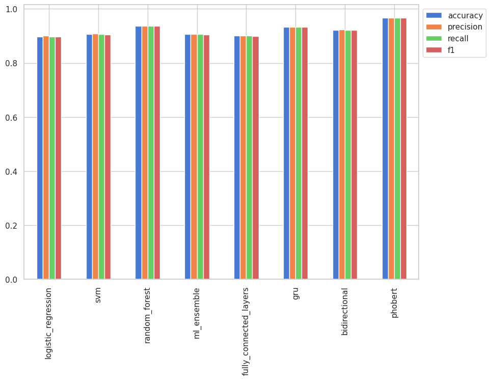

### 7.3. Phân tích chi tiết hiệu suất PhoBERT

PhoBERT không chỉ dẫn đầu về điểm số mà còn thể hiện sự ổn định vượt trội qua quy trình đánh giá chéo **Stratified K-Fold (5 folds)**. Mô hình được fine-tune từ backbone `vinai/phobert-base` – một mô hình Transformer được pre-trained trên hơn 20 GB văn bản tiếng Việt – và sử dụng cơ chế **Multi-Head Self-Attention** để nắm bắt mối quan hệ ngữ nghĩa hai chiều giữa các từ, kể cả các từ ghép phức tạp đặc trưng của tiếng Việt.

**Ưu điểm nổi bật của PhoBERT**:

- **Khả năng hiểu ngữ cảnh sâu sắc**: Khác với các mô hình truyền thống dựa trên Bag-of-Words (như Random Forest hay SVM) chỉ đếm tần suất từ, PhoBERT xử lý toàn bộ chuỗi văn bản cùng một lúc, nhận diện chính xác mỉa mai, phủ định kép, cấu trúc đảo ngữ và các sắc thái cảm xúc tinh tế.
- **Tận dụng tối đa kiến thức pre-trained**: Nhờ đã học sẵn ngữ nghĩa tiếng Việt từ corpus khổng lồ, mô hình chỉ cần fine-tune với learning rate rất nhỏ (2e-5) đã đạt hiệu suất cao ngay từ epoch đầu tiên.
- **Kháng nhiễu vượt trội**: Xử lý xuất sắc lỗi chính tả, emoji, từ viết tắt và cách diễn đạt không chuẩn thường gặp trong phản hồi của sinh viên.
- **Khả năng khái quát hóa cao**: Duy trì accuracy trên 94 % khi kiểm tra trên dữ liệu thực tế ngẫu nhiên, không bị overfitting dù lớp Neutral ban đầu chiếm tỷ lệ cực kỳ nhỏ.

**Hình 7.4**: Biểu đồ Training vs Validation Accuracy per Fold của Logistic Regression 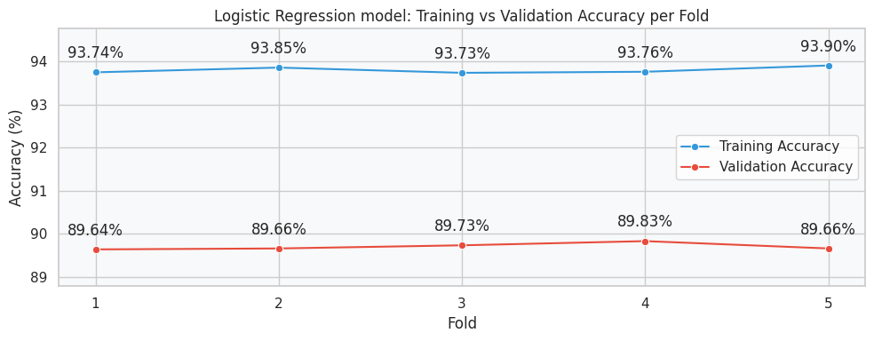  
**Hình 7.5**: Biểu đồ Training vs Validation Accuracy per Fold của SVM 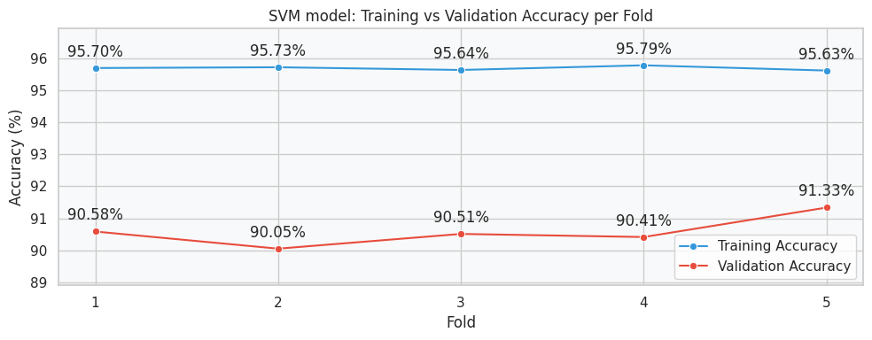  
**Hình 7.6**: Biểu đồ Training vs Validation Accuracy per Fold của Random Forest 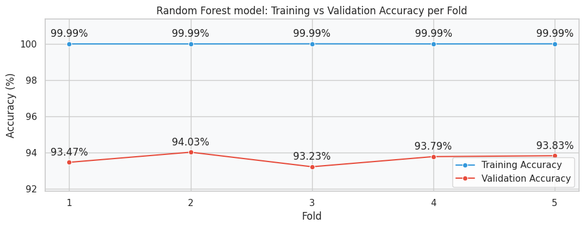  
**Hình 7.7**: Biểu đồ Training vs Validation Accuracy per Fold của Machine Learning Ensemble 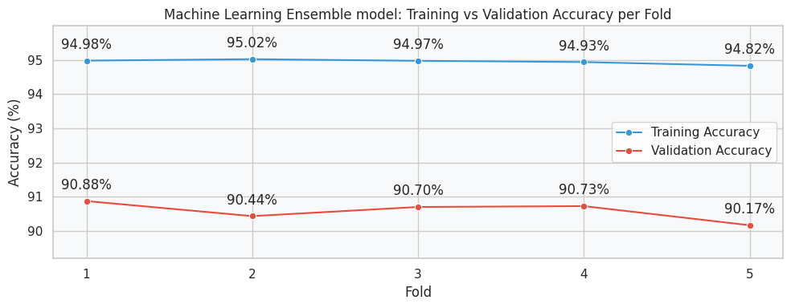

**Hình 7.8**: So sánh hiệu suất Logistic Regression vs PhoBERT 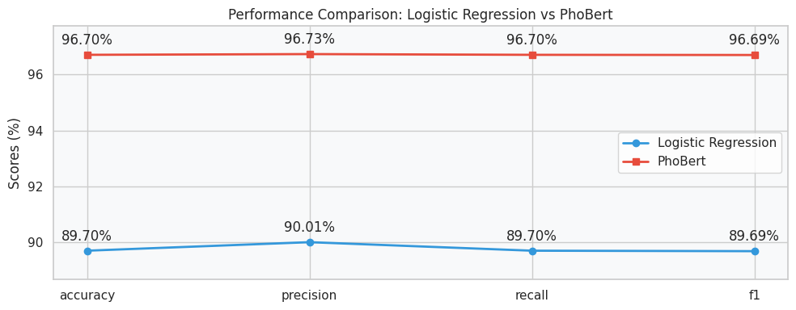

Khi so sánh trực tiếp, khoảng cách giữa PhoBERT và Random Forest (mô hình mạnh nhất trong nhóm Machine Learning) đạt hơn 3 điểm phần trăm ở cả Accuracy và F1-Score — một khoảng cách rất đáng kể trong lĩnh vực Xử lý Ngôn ngữ Tự nhiên.

### 7.4. Thảo luận

Kết quả thực nghiệm một lần nữa khẳng định rằng các mô hình truyền thống (Machine Learning) dù ổn định, dễ triển khai và tiết kiệm tài nguyên vẫn bị giới hạn bởi đặc trưng tĩnh (Bag-of-Words). Ngược lại, PhoBERT với kiến trúc Transformer hiện đại đã phá vỡ “semantic ceiling” của tiếng Việt, mang lại hiệu suất vượt trội và khả năng áp dụng thực tế cao nhất.

Sự thành công của PhoBERT không chỉ nằm ở các con số thống kê mà còn ở giá trị thực tiễn: hỗ trợ giảng viên và nhà trường phát hiện sớm, chính xác và kịp thời các vấn đề về chất lượng giảng dạy, chương trình đào tạo cũng như cơ sở vật chất. Đây chính là nền tảng quan trọng để xây dựng quy trình cải tiến liên tục (Continuous Improvement) trong giáo dục đại học Việt Nam.


